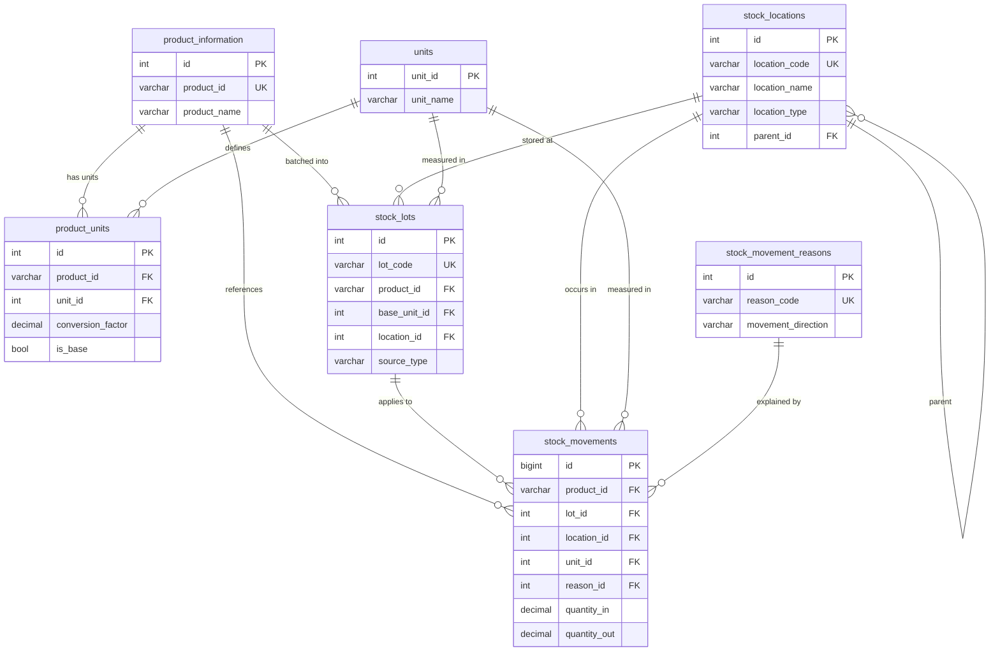

## Phase 1 - Core Inventory Model Deliverables

### 1. ERD Snapshot


### 2. Migration Execution Log
- Schema patch applied with  
  `mysql -u root everb --execute="SOURCE install/sql/patches/20251009_core_inventory_phase1.sql;"`.
- Seed/bootstrap patch applied with  
  `mysql -u root everb --execute="SOURCE install/sql/patches/20251009_core_inventory_phase1_seed.sql;"`.
- Validation queries run post-migration:
  - `DESCRIBE stock_locations;`
  - `DESCRIBE product_units;`
  - `DESCRIBE unit_conversions;`
  - `DESCRIBE stock_lots;`
  - `DESCRIBE stock_movement_reasons;`
  - `DESCRIBE stock_movements;`
  - `SELECT id, location_code, location_name, location_type FROM stock_locations ORDER BY id;`
  - `SELECT * FROM product_units;`
  - `SELECT id, reason_code, movement_direction FROM stock_movement_reasons;`
- Schema-only snapshot captured: `db_snapshots/baseline_phase1_schema.sql` (generated with `mysqldump --no-data everb`).

All queries returned expected structures and seed rows (see CLI log on 2025-10-09).

### 3. Data Validation Queries (for repetition)
```sql
-- Confirm no orphaned location parents
SELECT l.id, l.location_code
FROM stock_locations l
LEFT JOIN stock_locations p ON l.parent_id = p.id
WHERE l.parent_id IS NOT NULL AND p.id IS NULL;

-- Check duplicate lot codes (should return zero rows)
SELECT lot_code, COUNT(*) FROM stock_lots GROUP BY lot_code HAVING COUNT(*) > 1;

-- Product-unit coverage against existing products
SELECT p.product_id, p.product_name
FROM product_information p
LEFT JOIN product_units pu ON pu.product_id = p.product_id AND pu.is_base = 1
WHERE pu.id IS NULL;
```

### 4. Repository / Service Interfaces (planned contracts)
- `InventoryLocationRepository`
  - `findByCode(string $code): StockLocation`
  - `createLocation(array $payload): StockLocation`
  - `listActiveByType(string $type): array`
- `ProductUnitService`
  - `getBaseUnit(string $productId): Unit`
  - `convertQuantity(string $productId, int $fromUnitId, int $toUnitId, float $qty): float`
  - `ensureDefaults(string $productId): void`
- `LotRepository`
  - `createLot(array $payload): StockLot`
  - `findOpenLots(string $productId, int $locationId): array`
- `StockMovementService`
  - `postMovement(StockMovementDTO $dto): StockMovement`
  - `getOnHand(string $productId, int $locationId): QuantitySummary`
  - `listMovements(array $filters): PagedResult`

Interfaces will be implemented during Phase 2/3 when business logic is attached; definitions captured here for early code review.

### 5. Outstanding Risks & Resolutions
- **Costing method**: pending stakeholder choice (moving average vs FIFO). Logged for Phase 2 design.
- **Legacy report coexistence**: existing stock reports still read purchase/sales deltas; integration plan will be handled in Phase 5.
- **Negative stock policy**: requires governance decision before enforcement logic in Phase 3/4.

### 6. Acceptance Checklist
- [x] Tables created and verified in dev database.
- [x] Seed/bootstrapping script populated existing sheds and product units.
- [x] ERD and repository contracts documented (this file).
- [x] Validation queries prepared for reruns and automated tests.
- [ ] Stakeholder sign-off (pending meeting with ops/accounting).

### 7. Testing & Tooling Prep
- Proposed automated tests:
  - Migration smoke test to ensure all new tables exist and required indexes are present.
  - Repository contract tests (InventoryLocationRepository, StockMovementService) covering create/read flows once implementations land.
  - Data integrity test verifying base unit coverage per product and enforcing unique lot codes.
- Fixtures/seed data:
  - Use `install/sql/patches/20251009_core_inventory_phase1_seed.sql` before tests to preload locations and product units.
  - Provide sample lots/movements via future Phase 2 scripts (`tests/fixtures/stock_movements_seed.sql`, TBD).
- Tooling:
  - Execute patches using `mysql --execute="SOURCE ..."`; wrap in a simple bash/PowerShell script (`scripts/apply_inventory_patch.ps1`, TBD) for repeatable CI usage.

Phase 1 artifacts are complete; once stakeholder approval is recorded, proceed to Phase 2 implementation tasks.
